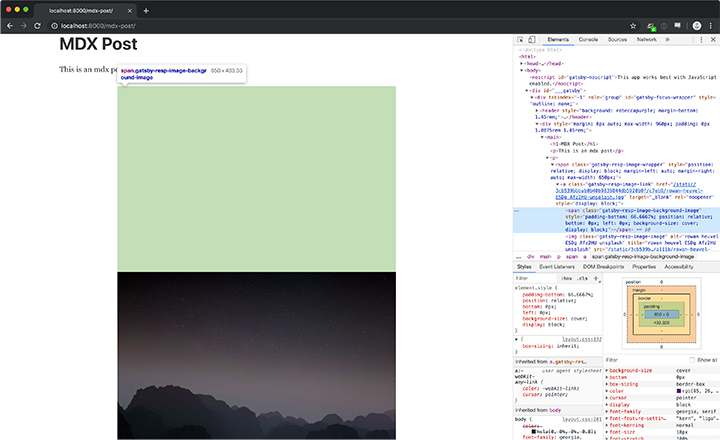

This repo exists to demonstrate a bug that presents when using `gatsby-remark-images` with `gatsby-plugin-mdx`.

__It seems as though the gatsby api calls (browser and ssr) made by `gatsby-remark-images` are not being run properly by `gatsby-plugin-mdx`.__

As of c4a7c40d63538704f8964cdeb1df8a04285e9b21, `gatsby-remark-images` injects a style tag in the document head to style to the markup it generates. These styles were previously inlined.

This works as intended when transforming markdown with `gatsby-transformer-remark`, but does not when transforming MDX with `gatsby-plugin-mdx`.

## Steps to reproduce

Clone this repo, run `yarn` and `gatsby develop`.

Navigate to `localhost:8000/mdx-post` and you'll see some layout issues. The injected style tag is missing.



Enable `gatsby-remark-images` as a plugin of `gatsby-transformer-remark` in `gatsby-config`

```
  ...
    {
      resolve: `gatsby-transformer-remark`,
      options: {
        // // uncomment this and the desired behavior returns
        // plugins: [ `gatsby-remark-images` ],
      }
    },
```

Quit and restart gatsby's dev server and revisit `/mdx-post`. The layout issues are resolved and our styles are generated as intended.
